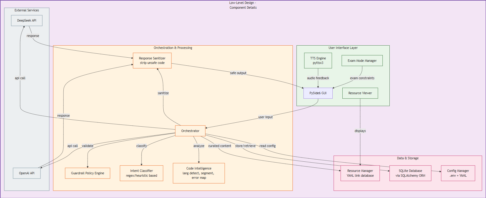
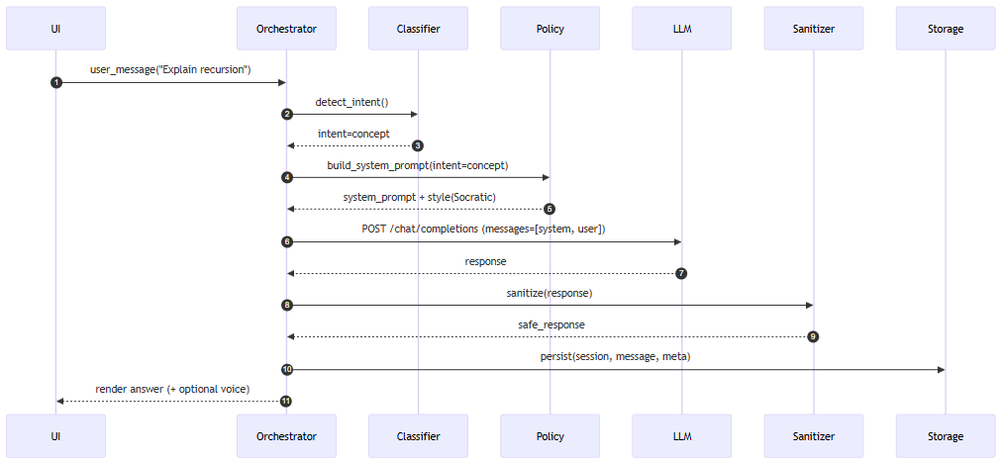

# EduTutor 🎓
**EduTutor** is an interactive AI tutor designed to help learners **explain code, debug errors, and explore computer science concepts**.
It features a **PySide6 GUI**, a modular **orchestrator layer**, and supports pluggable **LLM providers** (mock, OpenAI, DeepSeek, etc.).
A **persistence layer** using SQLite and SQLAlchemy stores conversation history.

---

## Architecture

### Component Overview




- **User Interface (PySide6 GUI):**
    - Buttons for *Concept*, *Error*, *Explain Code*, *Exam Mode*
    - Integrated TTS engine (pyttsx3)
- **Orchestration & Processing:**
    - `Orchestrator` manages flow:
        1. Intent classification
        2. Guardrail policy enforcement
        3. LLM provider invocation
        4. Response sanitization
        5. Conversation persistence
- **LLM Providers:**
    - Mock LLM (testing/offline)
    - OpenAI API wrapper
    - DeepSeek API wrapper
- **Persistence:**
    - SQLite via SQLAlchemy
    - YAML-based resource manager
- **External Services:**
    - OpenAI API
    - DeepSeek API

### Sequence Flow




1. User submits a message (e.g., `"Explain recursion"`).
2. Orchestrator detects intent and validates via policy engine.
3. LLM is queried with system and user prompts.
4. Response is sanitized and stored.
5. UI displays safe output (with optional TTS).

---

## Tech Stack

- **Language:** Python 3.10+
- **GUI:** [PySide6](https://doc.qt.io/qtforpython/)
- **AI Providers:** Mock LLM, OpenAI API, DeepSeek API
- **Persistence:** SQLite + SQLAlchemy ORM, YAML config
- **Orchestration:** Intent classifier, policy guardrails, sanitizer
- **Dev Tools:**
    - [pytest](https://docs.pytest.org/) + coverage
    - [mypy](https://mypy-lang.org/) (strict typing)
    - [ruff](https://docs.astral.sh/ruff/) (linting, autofix)
    - [black](https://black.readthedocs.io/) (formatting)
    - [isort](https://pycqa.github.io/isort/) (imports)
    - [pre-commit](https://pre-commit.com/)
    - [pip-audit](https://pypi.org/project/pip-audit/) (security audit)

---

## Getting Started

### 1. Clone and set up virtual environment

```powershell
git clone https://github.com/Abhi-lash19/edututor-core.git
cd edututor

python -m venv .venv
.\.venv\Scripts\Activate.ps1   # PowerShell
```

### 2. Install dependencies

```powershell
python -m pip install --upgrade pip
pip install -e ".[dev]"
```

### 3. Launch the application

```powershell
python -m edututor.app
```

### 4. Run tests

```powershell
pytest -v --maxfail=1 --disable-warnings --cov=src
```

### 5. Run linters and type checks

```powershell
ruff check src tests --fix
isort --profile black src tests
black .
mypy src
python -m pip_audit
```

---

## CI/CD Pipeline

GitHub Actions powers continuous integration:

- **Lint & Type Check (Python 3.11):**
        Runs ruff, black --check, isort --check-only, pre-commit, mypy, pip-audit.
- **Tests (Python 3.10, 3.11, 3.12):**
        Executes pytest with coverage and uploads reports to Codecov.
- **Build Verification:**
        Builds source and wheel (`python -m build`), verifies install and import.

Ensures style, safety, type correctness, tests, and package integrity on every PR and push to main.

---

## 📂 Repository Structure

```powershell
src/edututor/
├── app.py               # GUI entrypoint (PySide6)
├── core/
│   ├── orchestrator.py  # Orchestration pipeline
│   ├── classifiers.py   # Intent detection
│   ├── policy.py        # Guardrail rules
│   ├── sanitizer.py     # Strips unsafe code
│   └── templates.py
├── llm/
│   ├── base.py          # Abstract base LLM
│   ├── mock.py          # Mock LLM (unit tests)
│   └── openai_provider.py
├── persistence/
│   ├── db.py            # SQLite initialization
│   └── store.py         # Conversation storage
tests/                   # Unit tests
pyproject.toml           # Build, lint, type check config
```

---

## Project Status

- Core orchestrator, policy, sanitizer, classifier
- Mock LLM + OpenAI integration
- Persistence layer
- PySide6 GUI
- CI/CD pipeline
- 🔜 Planned: Expand resources, add more LLM providers, enhance UX
